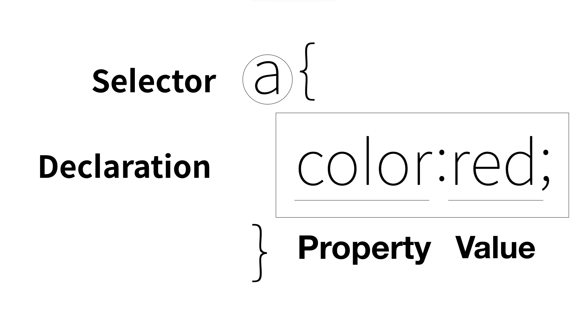

## CSS
-----
### CSS 등장 이전
    
- 모든 태그 안에 font태그를 사용해 효과를 줌
    - 정보를 나타내는 코드와 디자인을 나타내는 코드가 섞여 웹 페이지 정보 가치 저하
    - 같은 태그의 스타일을 바꾸려면 그 태그에 써넣은 모든 font 태그를 바꿔야하는 번거로움

###  &nbsp;&nbsp;&nbsp;&nbsp; = 이를 해결하기 위해 CSS 등장

  &nbsp; &nbsp; &nbsp; &nbsp; &nbsp; &nbsp; &nbsp; &nbsp; HEAD안에 style 태그를 넣어 웹브라우저가 CSS문법을 html문법으로 해석하게 함

 

### 장점

- 하나를 바꾸면 모든 게 바뀜
- 중복된 코드를 하나로 합칠 수 있어 웹페이지가 간결해짐
- 웹페이지의 유지/보수가 편해짐
- 디자인 코드와 정보 코드가 분리되어 직관적임

 

### 용어

 

</img>

- Selector : 웹페이지에 있는 모든 해당 태그를 선택
- Declaration : 선택자가 작성하는 태그에 대해 어떤 효과를 주는지
- Property : 속성
- value : 속성의 값

 

### CSS 속성 스스로 알아내기

&nbsp; 내가 원하는 효과가 어떤거고, 어디에 주고 싶은지 알고 있다면 방법을 몰라도 키워드만으로도 구글링해서 알 수 있음  
ex) 글씨를 키우고 싶으면 관련 키워드인 text, size, property 검색창에 입력

### CSS 선택자 스스로 알아내기

- 특징
    - 태그들을 그룹화시켜 한번에 효과를 줌
    - 여러 개의 값이 들어올 수 있음
    - 띄어쓰기로 구분
    - 한 개의 태그에 여러 개의 속성이 들어올 수 있음
    - 여러 개의 선택자를 통해 하나의 태그를 공동으로 제어 가능

- 선택자 우선 순위
    1. id : #을 붙여 사용
    2. class : .을 붙여 사용
    3. 태그 : 일반적인 태그
     
    = 코딩하기 편하다는 이유로 포괄적<구체적 순으로 되어 있음

 

### 박스모델

1. block level element : 화면 전체를 쓰는 태그
2. inline element : 자기 콘텐츠 만큼만 쓰는 태그
 
= display로 바꿀 수 있음

- comma(,)를 통해 중복 태그를 압축할 수 있음
- 웹페이지 우클릭 -> 검사 -> 태그 선택 -> styles 창에서 태그가 어떤 효과를 받고 있는지 쉽게 알 수 있음
   

 

### 그리드

&nbsp; &nbsp; &nbsp; 디자인이라는 목적을 위해 아무 의미도 없는 태그 = div, span
 
&nbsp; &nbsp; &nbsp; &nbsp; &nbsp; div = block level, span = inline

- 여러 태그를 배치하고 싶으면 부모 태그가 필요함
- display : grid; 를 주고 원하는 효과 넣기
    - 최신 CSS 기능을 사용하기 위해선 현재 사용해도 되는지 데이터에 근거해 판단해야함  
    &nbsp; &nbsp; -> CanIUse.com : CSS, HTML, JAVA SCRIPT의 기술 중 현재 웹브라우저들이 내가 원하는 기술을 채택하고 있는지 통계내는 사이트

 

### 반응형 디자인(미디어 쿼리)

&nbsp; &nbsp; &nbsp; 화면의 크기에 따라 웹페이지의 요소들이 반응해서 동작하게 함

- @media 로 조건과 효과 넣음
    - 미디어쿼리로 화면의 특성에 따라 조건을 걸고 동작하게끔 함
    - 구글개발자도구 -> 검사 -> elements -> 우상단에 화면 크기 표시할 수 있음

 

### CSS코드의 재사용
&nbsp; &nbsp; &nbsp; html이 아닌 css라는 별도의 파일을 만들어 링크를 걸어 사용

###  &nbsp;&nbsp; 장점

- 내부적인 코딩의 원리를 몰라도 사용 가능
- 여러 웹브라우저에 같은 효과를 일괄적으로 적용
- 코드의 양이 줄어 인터넷 사용료 절감
    - css파일 캐싱
    (=파일을 다운받고 저장된 결과만 갖고 와 웹페이지 속도를 높임)
    하여 웹브라우저를 더 빨리 사용가능하고 사업자는 비용 절감의 효과를 없음
