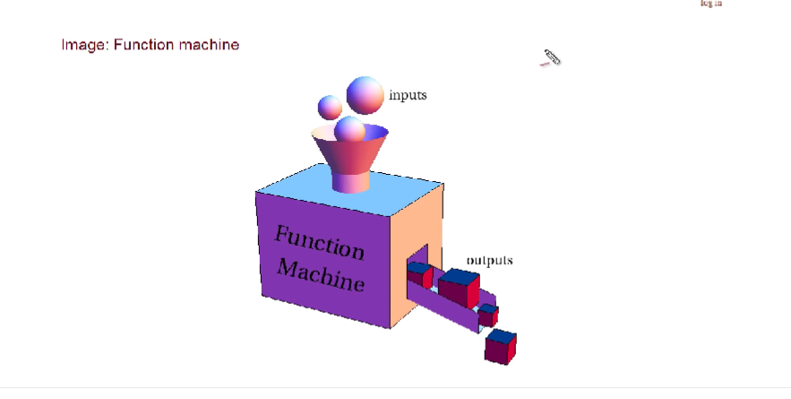

## 함수

function / 하나의 로직을 재실행 할 수 있도록 하는 것으로 코드의 재사용성을 높여준다.

<br>

### 형식
----

``` java script

function 함수명 ([인자...[,인자]]){
    코드
    return 반환값
}

```

예시 )

``` java script

function numbering(){
    document.write(1);
}
numbering();

```
1. func 뒤에 있는 numbering으로 정의한다.
2. 중괄호 안에 있는 doc.write 옆 소괄호 안 숫자 1이라는 값을 할당한다.
3. func 중괄호 바깥에 있는 numbering() 으로 함수에 넣었던 값을 호출한다.
    - 호출할 때 뒤에 괄호가 없으면 프로그램은 이걸 변수라고 생각한다. 때문에 괄호를 붙여야 앞서 적었던 func numbering을 찾아서 호출하는 것이다.

&nbsp;

### 정의와 호출
-----

- 소괄호 안 '인자'는 함수를 호출할 때 함수의 로직으로 전달될 변수로, 생략이 가능하다.
- 함수를 호출했을 때 실행할 부분이 중괄호 안쪽에 온다.

```java script

function numbering(){
    i = 0;
    while(i < 10){
        document.write(i);
        i += 1;
    }
}

```

<br>

### 효용성
----

``` java script

function numbering(){
    let i = 0;
    while(i < 10){
        document.write(i);
        i += 1;
    }
}
numbering();

```
반복문 ≠ 함수
 - 비슷하면서도 다르니까 잘 생각하자

#### 반복문
----

하나의 반복문 안에서만 여러 번 실행되는 것

#### 함수
-----

반복적으로 실행되는 로직이 여러 맥락에서 반복돼서 사용할 경우&nbsp; <br>
여러 코드에서 호출만 하면 사용할 수 있다는 뜻

개념
- 재사용성
- 유지보수 용이
- 가독성 good~

<br>

### 입력
--------
<br>
</img>

- 입력에 따라 출력이 달라지는 것

#### return
---

함수 내에서 사용한 return 뒤에 따라오는 값을 함수의 결과로 반환한다. 동시에 함수를 종료시킨다.

``` java script

function get_member1(){
    return 'egoing';
}

function get_member2(){
    return 'k8805';
}

alert(get_member1());
alert(get_member2());

```
1. get member 1과 2라는 함수 안에 각각 egoing과 k8805라는 값을 집어넣는다.
2. 'return'에 의해 egoing과 k8805라는 값은 중괄호 밖으로 빠져나온다.
3. alert으로 각 함수의 값을 호출한다. (member1=egoing, member2=k8805)

``` java scirpt

function get_member1(){
    return 'egoing';
    return 'leezche'
    return 'graphitti'
}
alert(get_member1());

```
실행되는 것 : egiong
- return이 등장했기 때문에 egoing이 밖으로 나간 후 함수가 종료됐기 때문 

<br>

### 출력
-----

#### 인자
----
argument / 함수로 유입되는 입력값 <br>
어떤 값을 인자로 전달하느냐에 따라 함수가 반환하는 값이나 메소드의 동작방법을 다르게 할 수 있다.

``` java script

function get_argument(arg){
    return arg*2000;
}
alert(get_argument(1));
alert(get_argument(2));

```
1. func argu소괄호 안에 alert argu소괄호 안에 있는 값을 넣는다.
2. return arg 값에 1000을 곱한 값을 배출한다.
3. alert argu로 차례로 1000과 2000를 호출한다.

arg = 매개변수(parameter) <br>
값 = 인자(argument)

#### 복수의 인자
------
```java script
function get_arguments(arg1, arg2){
    return arg1 + arg2;
}
alert(get_arguments(10, 20));
alert(get_arguments(20, 30));

```
1. func argus소괄호 안에 alert argus소괄호 안에 있는 값을 차례로 넣는다.
2. return arg 값에 arg1과 arg2를 더한 값을 배출한다.
3. alert argus로 차례로 30과 50를 호출한다.

return값을 하나만 가질 수 있다는 한계가 있음

<br>

### 다양한 정의 방법
----
1.
```java script
numbering = function(){
    i = 0;
    while(i < 10){
        document.write(i);
        i += 1;
    }
}
numbering();
```
- 함수의 정의 부분이 좌항에 있는 numbering에 대입된 것

<br>

2.
```java script
(function(){
    i = 0;
    while(i < 10){
        document.write(i);
        i += 1;
    }
})();
```
- 함수를 소괄호로 묶어 정의하고, 옆에 소괄호를 넣어 정의한 함수를 바로 호출하는 것 (= 익명함수, 일회성 호출용)

<br> <br>

## 배열

array / 연관된 데이터를 모아 통으로 관리하기 위해 사용하는 데이터 타입. <br>

변수 : 하나의 데이터 저장 <br>
배열 : 여러 개의 데이터를 하나의 변수에 저장

``` java script
let name = 'egoing'
alert(name);
```
- name을 호출하면 egoing이 뜸

<br>

### 생성
-----
대괄호[ ] : 배열을 만드는 기호 <br>
콤마( , ): 대괄호 안 데이터를 구분하게 해주는 것

``` java script
let member = ['egoing', 'k8805', 'sorialgi']
```
- member라는 변수 안에는 egoing, k8805, sorialgi라는 값이 담겨있는 것
- member를 실행했을 때 세 가지 모두 뜸
    - 하나씩 꺼내오려면 ___ 변수[index]

<br>

### 효용성
-----

#### 배열이 없다면?
- 하나의 변수 = 하나의 값 => 코드가 길어지고 지저분함

== 배열을 쓰자 !!

<br>

### 사용
-----
배열의 진가는 반복문과 결합했을 때 나타남

```java script
function get_member(){
    return['egoing', 'k8805', 'sorialgi']
}
members = get_members();

for(let i = 0; i < members.length; i++){
    document.write(members[i].toUpperCase());
}

//.toUpperCase : 소문자를 대문자로 변경해주는 함수

```
1. 함수 getmem에 세 가지 값을 담음
2. mem을 호출할 때 getmem의 값을 호출하게 함
3. mem의 길이를 읽게 해서 그 길이보다 작을때까지 반복문 실행
4. mem의 값을 대문자로 보여줌

<br>

### 기능
--------
배열은 복수의 데이터를 효율적으로 관리, 전달하기 위한 목적으로 고안된 데이터 타입 <br>
데이터의 추가/수정/삭제와 같은 일을 편리하게 할 수 있도록 돕는 다양한 기능을 갖고 있다.

1. 크기
    - 변수.length <br><br>
2. 추가
    - 변수.push : 뒤쪽
    - 변수.concat : 여러 개
    - 변수.unshift : 앞쪽
    - 변수.splice(index, howmany, element) : 특정구간을 추출/추가함 <br><br>
3. 제거
    - 변수.shift( ) : 앞쪽
    - 변수.pop( ) : 뒤쪽 <br><br>
4. 정렬
    - 변수.reverse( ) : 역순
    - 변수.sort( )
        - sort(sortfunc) : 직접 순서 정의


<br><br>

## 객체

object / index를 숫자가 아닌 문자로 사용하고 싶을 때

<br>

### 생성
------
1.
```java script
let grades = {'egoing': 10, 'k8805': 6, 'sorialgi': 80};
```
<br>

2.
```java script
let grades = {};
grades['egoing'] = 10;
grades['k8805'] = 6;
grades['soorialgi'] = 80;
```
<br>

3.
```java script
let grades = new Object();
grades['egoing'] = 10;
grades['k8805'] = 6;
grades['soorialgi'] = 80;
```

===grades를 실행하면 
Object {egoing: 10, k8805: 6, sorialgi: 80} 이라는 값이 나옴 <br>
필요한 값만 가져올 때 변수[값]; or 변수.값
<br>
[key] = value

<br>

### 객체와 반복문
------
```java script
let grades = ['egoing': 10,
'k8805': 6, 'soorialgi': 80];
for(key in grades){
    document.write("key : "+key+" value : "+grades[key]+"<br />");
}
```
배열에는 집어넣은 순서가 저장됨

<br>

### 객체지향 프로그래밍
---------
객체(object)에는 객체를 담을 수도, 함수를 담을 수도 있다.

```java script
let grades = {
    'list': {'egoing': 10, 'k8805': 6, 'sorialgi': 80},
    'show' : function(){
        for(let name in this list){
            document.write(name+ ':' + this.list[name] + "<br />");
        }
    }
}
//this : 함수가 속해있는 객체를 가리키는 변수


