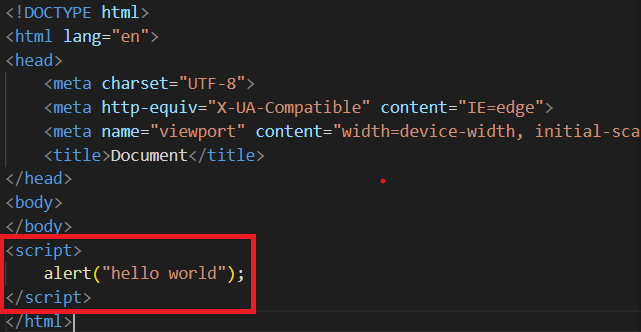
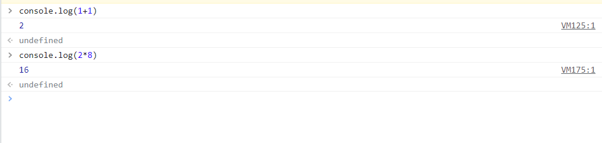
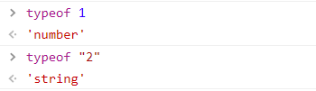

# JS 스터디 1주차
## 1. 실행방법과 실습환경
<hr/>

### 1-1. 코드의 작성과 실행

> * Chrome, JS에디터(window - 메모장)   
> * 우리는 **VScode**로 진행.   
> * 파일생성후 '파일명.hmtl'를 통해 html파일 생성 후 script 태그를 통해 작성    
> * 웹브라우저에서 'ctrl+O'를 통해 파일 열기

* 자바스크립트의 코드 예제   

<hr/>

### 1-2. 콘솔 사용법 
> 1. Chrome 기준, F12버튼을 통한 개발자 도구 열기.   
> 2. 개발자 도구에서의 'show console'버튼을 통한 Console창 열기
> 3. 이후 순수하게 js 코드만 작성하면 바로 실행가능.
> * 짧은건 console창, 긴건 파일로 만들어서 실행하는 것이 편리.
> 4. 이전에 작성한 것을 다시한번 작성하고 싶을 때는 화살표 위방향을 '↑' 통해 이전 작성한 명령어를 불러올 수 있음.
> 5. 'console.log('출력 내용')' 명령어를 통해 console창에 출력할 수 있음. 
> ```
>   <script>
>        console.log('hello world');
>    </script>
> ```
> * 다른 언어의 print, printf등과 같은 역할.
<hr/>

### 1-3. 주석
> * 콘솔을 통해 오류확인 가능.
> * 주석은 맨 앞에 '//' 를 통해 처리.
> * VScode에서는 해당 줄 맨 끝에 가서 'ctrl+/'를 통해 처리.
> * 한줄 주석
> ```
> <script>
>       //console.log는 콘솔창에 출력하는 명령어 입니다.
>       console.log('hello world');
> </script>
> ```
> * 여러줄 주석
> ```
> <script>
>       /*
>       console.log('hello world');
>       console.log('hello world');
>       console.log('hello world');
>       console.log('hello world');
>       */
> </script>
> ```
<hr/>

### 1-4. 줄바꿈과 여백
> ```
> <script>
>       var a = 1;
>       alert(a);
> <script>
> ```
> * ';' 세미콜론은 명령이 끝났다라는 것을 명시적으로 표시하기 위함.
> * 하지만 js에서는 ';'가없어도 줄바꿈이 있다면 명령이 끝났다라고 간주.
> * 들여쓰기,여백을 하는 이유는 가독성때문.
<hr/>

## 2. 숫자와 문자
<hr/>

### 2-1. 수의 표현
> * 영상에서는 VScode가 아닌 다른 에디터를 이용하지만 우리는 VScode사용. 
> ```
> <script>
>       alert(1);       //자연수 표현
>       alert(1.1);     //실수 표현
>       alert(1+1);     //2출력
>       alert(2*8);     //16출력
> <script>
> ```
> * Chrome 콘솔창(F12)에서 진행 시 바로 결과 확인 가능.
> 
<hr/>

### 2-2. 수의 연산
> * Math객체를 이용(객체는 나중에 배울거에요!)
> * Math.pow(n,m) : n의 m제곱
> * Math.round() : 반올림
> * Math.ceil() : 올림
> * Math.floor() : 내림
> * Math.sqrt(n) : n의 제곱근
> * Math.random() : 0부터 1.0 사이의 랜덤한 숫자 출력
<hr/>

### 2-3. 문자
> * 문자는 " " 또는 ; ' '사이에 작성
> ```
> <script>
>   alert("hello world");
> </script>
> ```
>* " 로 시작했는데, '로 닫아주면 문법적 오류 발생
>* ' '사이에 '를 쓰고 싶다면 \를 '앞에 써주면 사용 가능
>* \ 뒤에 있는 기호는 그냥 정보로써 해석
>* 1과 '1'은 다른 형식.
>* typeof 를통해 확인 가능.
>
<hr/>

### 2-4. 문자의 연산
> * 문자열에서 \n은 줄바꿈.
> * 문자열과 문자열을 결합하려면 '+' 연산자를 사용.
> * 숫자와 문자들의 연산은 다름.
> * '문자열.length'를 통해 문자열의 길이를 출력할 수 있음
> * '문자열.indexOf'를 통해 문자열의 자리를 구할 수 있음.
<hr/>

## 3. 변수
<hr/>

### 3-1. 변수의 사용법
> * JS에서 변수는 'var'이라는 키워드를 사용, 생략가능.
> * 변수에 넣은 값은 변할 수 있음
> * 변수끼리의 연산이 가능
> * 변수 안에는 수뿐만이 아닌 문자도 담을 수 있음.
<hr/>

### 3-2. 변수의 효용
> * 변수의 사용 목적 : **코드의 재활용성**
<hr/>

## 4. 비교
<hr/>

### 4-1. 연산자란?
> * 어떠한 작업을 컴퓨터에게 지시하기 위한 기호
> * 대입연산자 : '=' , 좌항에 있는 값을 우항에 대입
> * 비교연산자 : '>' , '<' , '<=' , '>=' , '==' , 비교연산자에 의한 결과는 true와 false 두가지의 값(boolean)중 하나를 갖게됨.
<hr/>

### 4-2. == , ===
> * 동등연산자 : '==', equaloperator, 좌항과 우항을 비교해 값이 같다면 true, 다르면 false를 출력
> * 일치연산자 : '===', 좌항과 우항의 값이 정확하게 같은지 비교하여 값이 같다면 true, 다르면 false를 출력    
>   * 비슷과 정확하게 같음의 차이.      

<hr/>

### 4-3. ===를 사용하자
> * 'NULL'은 값이 없다라는 의미
> * 'undefined'는 값이 정의되지 않음을 의미
>   * 값이 없다는 것과 값이 정의되지 않음은 다름.
> * '=='은 1을 ture로 간주, 1이 아닌 수들을 flase로 간주.
> * '==='은 1과 true는 다름, '1'과도 다름. 완전히 같아야함.
> * '0===0'은 true, 'NaN(계산할 수 없음) === NaN'은 false
<hr/>

### 4-4. 부정과 부등호
> * '!'는 부정, 같지 않다 를 의미.
> * '!='는 '=='의 반대
> * '!=='는 '==='의 반대
> * 부등호 : 숫자들을 비교할때 사용
>   * '>' , '<' , '>=', '<=' 

