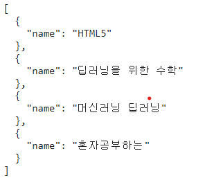

## 챕터 5-1.
<hr/>

### 1번.
> ```
> <script>
>   function multiplyAll(a,b){
>       let result=1;
>       for (let i = a; i<=b; i++){
>           result= result*i
>       }
>       return result;
>   }
>   console.log(multiplyAll(1,2))
>   console.log(multiplyAll(1,3))
> </script>
> ```

### 2-1번.
> ```
> <script>
>   const max=function(array){
>       let output=array[0]
>       for(item of array){
>           if(output < item){
>               output=item;
>           }
>       }
>       return output
>   }
>
>   console.log(max([1,2,3,4]))
> </script>
> ```

### 2-2번.
> ```
> <script>
>   const max=function(...array){
>       let output=array[0]
>       for(let i =0; i<){
>           if(output < item){
>               output=item;
>           }
>       }
>       return output
>   }
>
>   console.log(max(1,2,3,4))
> </script>
> ```

### 2-3번.
> ```
><script>
>    const max=function(array, ...rests){
>    let output
>    let arrays
>
>    if (Array.isArray(array)){
>        output=array[0]
>        arrays=array
>    }else{
>        output = array
>        arrays = rests
>    }
>
>    for(const item of arrays){
>        if(output < item){
>            output=item;
>        }
>    }
>    return output
>    }
>
>    console.log(`max(배열): ${max([1,2,3,4])}`)
>    console.log(`max(숫자, ...): ${max([1,2,3,4])}`)
></script>
> ```
<hr/>

## 챕터 5-2.
<hr/>

### 1번.
> ```
><script>
>   let numbers=[273,25,75,52,103,32,57,24,76]
>   numbers=numbers
>       //홀수만 추출
>       .filter((value)=>value%2===1)
>        //100이하의 수만 추출
>        .filter((value)=>value<=100)
>        //5로 나눈 나머지가 0인 수만 추출
>        .filter((value)=>value%5===0)
>    console.log(numbers)
></script>
> ```

### 2번.
> ```
><script>
>   const array=['사과','배','귤','바나나']
>
>   console.log('# for in 반복문')
>   array.forEach((value,index)=>console.log(index))
>
>   console.log('# for of 반복문')
>   array.forEach((value)=>console.log(value))
></script>
> ```
<hr/>

## 챕터 6-1.
<hr/>

### 1번.
>```
>   const book{}
>   book.name='혼자 공부하는 파이썬'
>   book.price=18000
>   book.publisher='한빛미디어'
>```

### 2번.
>3번

### 3번.
>1번

### 4번.
>```
>   print: function(lang){
>       console.log(`${this.ko}는 ${this.lang[lang]}로 ${this[lang]}입니다.`)
>   }
>```
> 결과: "빵는 스페인어로 pan입니다."
<hr/>

## 챕터 6-2.
<hr/>

### 1번.
>undefined, 이유는 num은 기본 자료형이므로 일시적으로 기본자료형승급으로 인해 객체자료형으로 변화하여 'num.원'이 가능했지만 문장이 끝나면 무효화됨.

### 2번.
>printLang("ko"): 한국어
>printLang("en"): 영어

### 3번.
> Math.sin(x)에서 x는 degree값이 아닌 라디안 값을 사용
> 따라서 90도를 라디안으로 변환해야함
>```
><script>
>   const degree=90
>   console.log(Math.sin(degree*Math.PI/180))
></script>
>```

### 4번.
>2번

### 5번.
>```
><script>
>   const output=_.orderBy(books,['name'],['asc'])
>   console.log(JSON.stringify(output,null,2))
></script>
>```
>
<hr/>

## 챕터 6-3.
<hr/>

### 1번.
> 2번

### 2번.
> [jQuery](https://kinsta.com/blog/javascript-libraries/#jquery)   
> [React.js](https://kinsta.com/blog/javascript-libraries/#reactjs)   
> [D3.js](https://kinsta.com/blog/javascript-libraries/#d3js)   
> [Underscore.js](https://kinsta.com/blog/javascript-libraries/#underscorejs)   
> [Lodash](https://kinsta.com/blog/javascript-libraries/#lodash)   
> [AlgoliaPlaces](https://kinsta.com/blog/javascript-libraries/#algolia-places)   
> [Anime.js](https://kinsta.com/blog/javascript-libraries/#animejs)